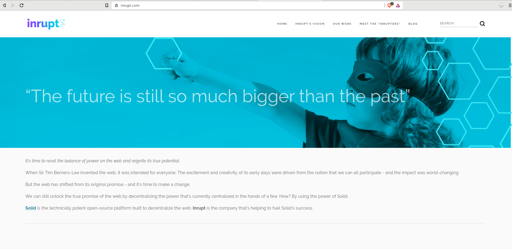
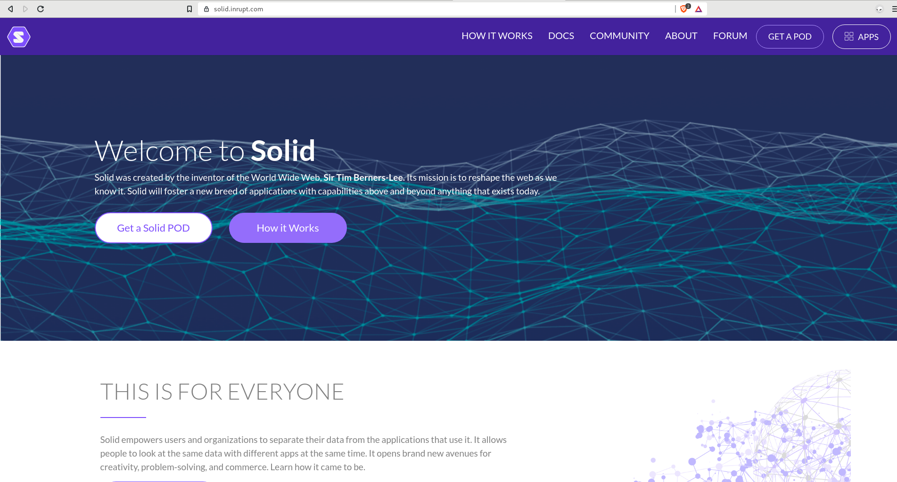
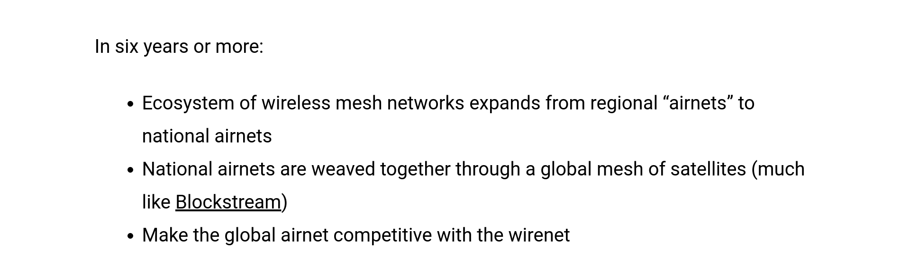

import { Head } from 'mdx-deck'
import { Appear } from 'mdx-deck'
import Cover from './components/cover'
import About from './components/about'
import RehabCounter from './components/rehab-counter'
import { Image } from 'mdx-deck'
import ImageText  from './components/image-text'
import Video  from './components/video'

<Head>
  <title>Falhamos! Precisamos re-descentralizar a Web!</title>
    <meta name="description" content="Desenvolvimento de Software (JavaScript), devaneios e outras coisas" />
    <meta name="author" content="Jaydson Gomes" />
    <link rel="apple-touch-icon" href="https://jaydson.com//img/apple-touch-icon.png" />
    <link rel="icon" href="https://jaydson.com/img/favicon.ico" />
</Head>

<Cover imgSrc="./static/thomas-tucker-129635-unsplash.jpg" title="FALHAMOS!" content="Precisamos re-descentralizar a Web!"/>

---

# ⚠️️️️️️️️️️️️️️️️️⚠️⚠️
### Esta palestra contém:
<ul>
  <Appear>
    <li>Altas doses de Niilismo 👻</li>
    <li>Punk 🤘</li>
    <li>Zero fucks given 🖕</li>
    <li>💩💩💩</li>
  </Appear>
</ul>

---

# Interlude 😎

---

> "It's not the right time to be sober, now the idiots have taken over"
<span>― Fat Mike, NOFX</span>

---

<Image src='./static/got.gif' />

---

<ImageText imgSrc="./static/planet-destroyed.jpeg" content="Yes, the planet got destroyed. But for a beatiful moment in time we created a lot of value for shareholders"/>

```notes
- Cartoon feito pelo NewYorker
- Luigi Zingales - A capitalism for the people
```

---

# 💩💩💩

---

```
{
    name: "Jaydson Gomes",
    company: ["Nasc /  BrazilJS"],
    title: ["Empreendedor", "Programador"],
    contact: {
        website: "https://jaydson.com",
        email: "jaydson@nasc.io"
    }
}
```
---

<RehabCounter />

---

<Image src='./static/social-rehab.png' />

```notes
- Para quem quiser saber mais, ACESSE O MEU SITE!
- Não o meu Facebook, Twitter ou whatever, E SIM O MEU SITE!7
- A moral da história é que...
```

---

# Capítulo I - `Problemas` 👻

---

> "Social media is `destroying` society"

```notes
- Eleições, polarização, mercado em geral (social media está em cima de uma camada, a internet)
- E mais...
```
---

> "Social media has `eroded` the core foundations of how people behave by and between each other"


```notes
- Todo mundo tem uma opinião mesmo sem saber o que está falando
- Críticas desnecessárias
- Discurso de ódio
- Informações falsas
```

---

<ImageText imgSrc="./static/chamath_palihapitiya.jpg" content="Chamath Palihapitiya"/>

```notes
- Chamath Palihapitiya, VP no Facebok de 2007 a 2011
- Falando em Facebook que é a principal rede social, vamos ver mais..
```

---

> “It’s a social-validation `feedback loop` … exactly the kind of thing that a hacker like myself would come up with, because you’re `exploiting` a `vulnerability` in human `psychology`.”

---

> "How do we consume as much of your time and conscious attention as possible?” It was this mindset that led to the creation of features such as the 'like' button that would give users `a little dopamine hit` to encourage them to upload more content"

---

<ImageText imgSrc="./static/seanparker.jpg" content="Sean Parker" />

---

# Feedback loop
---

<Image src="./static/warm-news-edited.jpg" />

```notes
- Sabe quando não se está bêbado em uma festa?
```

---

<Image src="./static/social_media_zombies.jpg" />

```notes
- Temos um culpado?
```
---

<Image src="./static/suckerberg.png" />

---

> "Move fast and break things. Unless you are breaking stuff, you are not moving fast enough" 💩
<span>― Mark Suckerberg</span>

---

> "The biggest risk is not taking any risk... In a world that changing really quickly, the only strategy that is guaranteed to fail is not taking risks" 💩
<span>― Mark Suckerberg</span>

---

> "If things aren’t breaking, then you’re not moving fast enough. People learn by making mistakes" 💩
<span>― Mark Suckerberg</span>

---

# 🖕🖕🖕

---

# 💰 A ilusão do <i>free</i> 💰

---

<Image src="./static/who-owns-the-future.jpeg" />

---

# Mercado 💩💩💩
<ul>
  <Appear>
    <li>Marketing / Publicidade 💩</li>
    <li>Outbrain e semelhantes 🖕</li>
    <li>Fake news 🗞</li>
    <li>Jornalismo (clickbait, sensacionalismo, futilidade) 😕</li>
    <li>Growth Hacking 🙄🙄🙄</li>
    <li>Tecnologia 🤓</li>
    <li>Bullshit</li>
    <li>Et cetera ad infinitum</li>
  </Appear>
</ul>

```notes
Marketing: Inbound, conteúdo raso
Fake news: 
Tecnologia: Grandes eventos de tecnologia se tornaram pura bullshit

```

---

> "Alcance mais de um bilhão de usuários relevantes para seu negócio em grandes portais do país através da Plataforma de Descoberta de Conteúdo que é líder mundial" 💩
<span>― Taboola</span>

---

> "A premium discovery platform that helps connect marketers to their target audience through personalized recommendations on the world's leading publishers. We use proprietary interest and behavioral data to capture audience’s attention all the way to inspiring their next action" 💩
<span>― Outbrain</span>

---

<Image src="./static/out-taboola.png" />

---

<Image src="./static/out-taboola-2.png" />

---

# 🤣🤦

```notes
Na tecnologia? Exemplo sobre A.I.
```

---

> "I'd expect just more of rather targeted AI, rather than anything human-like at all. Language recognition, pattern recognition, things like that. I just don't see the situation where you suddenly have some existential crisis because your dishwasher is starting to discuss Sartre with you" 🤘
<span>― Linus Torvalds</span>

---

> "The whole 'Singularity' kind of event? Yeah, it's science fiction, and not very good Sci-Fi at that, in my opinion. Unending exponential growth? What drugs are those people on? I mean, really" 🤘
<span>― Linus Torvalds</span>

---

# Estado / Sociedade 💩💩💩
<ul>
  <Appear>
    <li>Política</li>
    <li>Democracia</li>
    <li>Capitalismo</li>
  </Appear>
</ul>

---

<Image src="./static/elijah-o-donnell-715864-unsplash.jpg" />

---

 # Open-source / Open-standard

 ```notes
 - Cultura do open-source
 - Santos Dummond (pode ser considerado um dos primeiros projetos open-source?)
 - TCP/IP (não estaríamos falando sobre Web aqui e nem zumbizando no Instagram - contraponto com o Google que tb se originou de um paper)
 - Linux (IBM > RedHat US$ 34 bilhões)
 - Firefox (mudou o mercado de navegadores e modlou o mundo open-source)
 ```

---

 # Web

---

# Capítulo II - `The Web` 🎉

---

<Video src="./static/internet-90s.mp4" />

---
## The Internet
"The `Internet` is the `global system of interconnected computer networks` that use the `Internet protocol` suite `(TCP/IP)` to `link devices worldwide`. It is a `network of networks` that consists of private, public, academic, business, and government networks of local to global scope, linked by a broad array of electronic, wireless, and optical networking technologies. The Internet carries a vast range of information resources and services, such as the inter-linked `hypertext documents` and `applications` of the World Wide Web (WWW), `electronic mail`, telephony, and `file sharing`"

---

## The Web
"The `World Wide Web (WWW)`, also called `the Web`, is an `information space` where `documents` and other `web resources` are identified by `Uniform Resource Locators` (URLs), interlinked by `hypertext links`, and accessible via the `Internet`. The `World Wide Web` has been central to the `development` of the `Information Age` and is the `primary tool billions` of people use to interact on the `Internet`"

```notes
- Stores (Google e Apple)
- Exercício de uma plataforma para o futuro
```

---

<Image src="./static/the-web-1.png" />

---

<Image src="./static/the-web-2.png" />

---

<Image src="./static/web.jpg" />

---

<Image src="./static/top-20.png" />

---

<Image src="./static/table-top-web.png" />

---

# Capítulo III - `Mais problemas` 🙄

---

<Image src="./static/simondseconoart.png" />

---

<Image src="./static/web-dying.png" />

---

<Image src="./static/internet-latin-america-2016.png" />

---


```notes
Another demonstration of GOOG and FB dominance can be seen among media websites. The most popular web properties that don’t belong to GOOG nor FB are usually from the press.
```

---


```notes
Ainda podemos salvar a próxima revolução
```

---


---

# A Web nasceu com intuito de ser inclusiva e acessível. Infelizmente, o retrato atual não reflete a sua origem.

---

> "The web has evolved into an `engine of inequity` and `division`; swayed by `powerful forces` who use it for their own agendas. Today, I believe we’ve reached a `critical tipping point` , and that powerful change for the better is `possible` — and `necessary`"
<span>― Tim Berners-Lee</span>

---

A Web hoje, infelizmente, é um reflexo da desigualdade no mundo, onde pessoas offline em sua grande maioria são mulheres, pessoas com baixa renda, pessoas que vivem em áreas rurais, países de terceiro mundo ou a combinação dos itens anteriores.

---

# Não estar conectado na Internet pode significar a perda de oportunidades de aprendizado, acesso a serviços úteis, etc.

```notes
Em contraponto, levando em consideração a situação atual da Web, estar conectado também pode caracterizar o acesso desenfreado de informações falsas, o rastreamento de dados pessoais sem consentimento e, sem saber o que isso pode causar, estar sendo influenciado politicamente, vigiado pelo governo e manipulado por grandes corporações.
Post no blog: https://braziljs.org/blog/29-anos-da-web-devemos-celebrar/
```

---

<Image src="./static/for-the-web.png" />

---

# Capítulo IV - `Soluções e futuro`

---



---



---

<Image src="./static/brave.png" />

---

<Image src="./static/manyverse.png" />

---

# Alternativas técnicas para o futuro

<ul>
  <Appear>
    <li>Always bet on WEB!!!!</li>
    <li>Solid</li>
    <li>P2P</li>
    <li>DAT</li>
    <li>Mesh!</li>
  </Appear>
</ul>

```notes
- Web > Falar sobre stores
```

---

A `mesh network` (or simply `Meshnet`) is a local network topology in which the infrastructure nodes (i.e. bridges, switches and other infrastructure devices) `connect directly`, `dynamically` and `non-hierarchically` to as many other nodes as possible and `cooperate` with one another to efficiently route data from/to clients.

---

<Image src="./static/gotenna.png" />

---

<Image src="./static/dat.png" />

---

<Image src="./static/beaker.png" />

---

<Image src="./static/rescue.png" />

---

<Image src="./static/rescue-1.png" />

---

<Image src="./static/rescue-2.png" />

---



---

# Alternativas culturais

<ul>
  <Appear>
    <li>Chrome > Firefox / Brave / Beaker</li>
    <li>Google > DuckDuckGo</li>
    <li>Facebook/Instagram > Vida</li>
    <li>Google Drive > NextCloud</li>
    <li>Google Mapas > Maps.me</li>
    <li>Google Hangouts/Skype > Jitsi Meet</li>
    <li>WhatsApp > Telegram</li>
    <li>Slack/Facebook/etc > Rocket.chat</li>
  </Appear>
</ul>

---

# The end

---

> "We should never underestimate human stupidity"
<span>― Yuval Noah Harari</span>